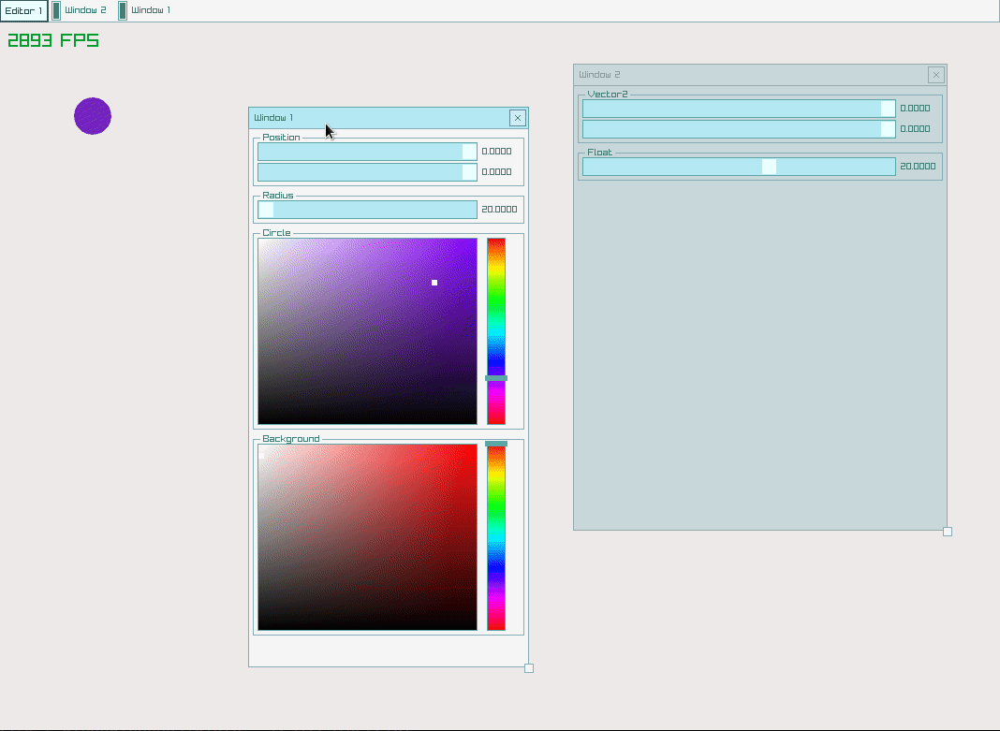

# Nimraygui Editor
A simple editor and "window manager" for nimraylib_now.
The library depends on `nimraylib_now` which is a port of the amazing `raylib`.
This is a thin layer around `raygui` to easily create windows with variables that are editable at runtime.

# Currently Supported Types
- [X] Vector3
- [X] Vector2
- [X] Color
- [X] float
- [ ] int
- [X] bool

- [ ] seq
- [ ] array
- [ ] Tables

# Future goals
- [ ] Arbitrarily nested type editing such as tuples and objects
- [ ] Data serialization and deserialization

# Example


```nim

import nimraygui_editor
import nimraylib_now

template rect*(tx, ty, tw, th = 0.0): Rectangle = Rectangle(x: tx, y: ty, width: tw, height: th)
template rgba*(tr, tg, tb: uint8 = 0, ta: uint8 = 255): Color = Color(r: tr, g: tg, b: tb, a: ta)
template vec3*(tx, ty, tz = 0.0): Vector3 = Vector3(x: tx, y: ty, z: tz)
template vec2*(tx, ty = 0.0): Vector2 = Vector2(x: tx, y: ty)

proc main() =
  setConfigFlags(WINDOW_RESIZABLE or MSAA_4X_HINT)
  initWindow(800, 700, "Nim Editor Example")
  setTargetFPS 60

  let
    editor = newEditor("Editor 1")
    window2 = newEWindow("Window 2", rect(50, 50, 400, 170))
    window1 = newEWindow("Window 1", rect(30, 30, 300, 570))

  var
    testVector2 = vec2(0, 0)
    testFloat = 20.0

    background = BLACK
    circleColor = RED

    testVector3 = vec3(0.0, 0.0, 0.0)

  window1.addProp newProp(testVector2, "Position").withMinMax(vec2(-100, -100), vec2(500, 500))
  window1.addProp newProp(testFloat, "Radius").withMinMax(0.001, 500.0)
  window1.addProp newProp(testVector3)
  window1.addProp newProp(circleColor, "Circle")
  window1.addProp newProp(background, "Background")
  editor.addWindow window1

  window2.addProp newProp(testVector2)
  window2.addProp newProp(testFloat)
  editor.addWindow window2

  while not windowShouldClose():
    updateEditor(editor)

    beginDrawing():
      clearBackground background

      beginEditor(editor):
        if isKeyPressed(KeyboardKey.F10):
          editor.enabled = not editor.enabled

        drawCircleV(testVector2 + vec2(100.0, 100.0), testFloat, circleColor)
        drawFPS 10, 10

  closeWindow()


when isMainModule:
  main()

```